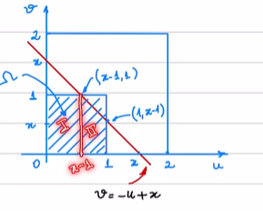

# Questão 1

Sob $P(|X-1|=2)=0$, indica uma v.a contínua, assim:

$$\begin{aligned}
    P(|X-1|\ge2)=&
    1-P(|X-1|\le2)=
    1-P(-2\le X-1\le2)=\\
    =&
    1-P(-1\le X\le 3)=1-[F_X(3)-F_X(-1)]\\
    =&
    F_X(-1)+1-F_X(3)
\end{aligned}$$

# Questão 2

$$F_X(x)=\begin{cases}
    0 &,x<0\\
    \frac{x}{a} &,0\le x<a\\
    1 &,x\ge a
\end{cases}$$

# Questão 3

$$\begin{aligned}
    X(u,v)&=u+v
    \\x&= [0,1]
\end{aligned}$$

Para um quadrado no plano $u \times v$ obtemos duas funções:

$X: \Omega\rightarrow\mathbb{R}$
$(u,v)\rightarrow X(u,v)=u+v$

Notemos que $P(0\le X\le 2)=1$

Sabendo que a área do quadrado $[0,1]\times[0,1]$ é igual a 1.

então divididos os casos em 4:

+ $x<0$
  $$F_X(x)=0$$

+ $0\le x<1$
  $$\begin{aligned}
      F_X(x)=&
      P(X\le x)=\frac{área(\{(u,v)\in \Omega|u+v\le x\})}{área(\Omega)}=
      \\=&
      área(\{(u,v)\in \Omega|u+v\le x\})=\\  
      \\=&
      \int_0^{x}\int_0^{x-u}1\;dvdu=
      \\=&
      \int_0^{x}x-u\;du=
      \\=&
      x.x-\frac{x^2}{2}=
      \\=&
      \frac{x^2}{2}
  \end{aligned}$$

+ $1\le x<2$
  

  $$\begin{aligned}
      F_X(x)=&
      P(X\le x)=\frac{área(\{(u,v)\in \Omega|u+v\le x\})}{área(\Omega)}=
      \\=&
      área(\{(u,v)\in \Omega|u+v\le x\})=\\  
      \\=&
      \int_0^{x-1}\int_0^{1}1\;dvdu\;+\int_{x-1}^{1}\int_0^{x-u}1\;dvdu=
      \\=&
      \int_0^{x-1} 1\;du\;+\int_{x-1}^{1}x-u \;du=
      \\=&
        x-1+x-\frac{1}{2} -[x(x-1)-\frac{(x-1)^2}{2}] =
      \\=&
        x-1+x-\frac{1}{2} -x(x-1)+\frac{(x-1)^2}{2} =
      \\=&
        x-1+x-\frac{1}{2} -x^2+x+\frac{x^2-2x+1}{2} =
      \\=&
        -1+2x -\frac{x^2}{2}
  \end{aligned}$$

+ $x\ge 2$

$$F_X(x)=P(X\le x)=P(\Omega)=1$$

Portanto
$$F_X(x)=\begin{cases}
    0 &, x<0\\
    \frac{x^2}{2} &, 0\le x <1\\
    -1+2x-\frac{x^2}{2} &, 1\le x <2\\
    1 &, x>2\\
\end{cases}$$

# Questão 4

Sabendo que $F_X'(x)=f_X(x)$, então:

2)

$$f_X(x)=\begin{cases}
    0 &,x<0\\
    \frac{1}{a} &,0\le x<a\\
    1 &,x\ge a
\end{cases}$$

3)

$$f_X(x)=\begin{cases}
    x &, 0\le x <1\\
    2-x &, 1\le x <2\\
    0 &, \;c.c\\
\end{cases}$$

# Questão 5

$$F(x)=\begin{cases}
    1- e^{-\lambda x} &, x>0\\
    0, &, X\le 0
\end{cases}$$

Para $F(m)=\frac{1}{2}=G(m)=1-F(m)$

$$\begin{aligned}
    1- e^{-\lambda m} &= 1-( 1- e^{-\lambda m})\\
    1- e^{-\lambda m} &= 1- 1+ e^{-\lambda m}\\
    1- e^{-\lambda m} &= e^{-\lambda m}\\
    2e^{-\lambda m} &= 1\\
    e^{-\lambda m} &= \frac{1}{2}\\
    \ln \left(\frac{1}{2}\right) &= -\lambda m\\
    \ln 1- \ln 2 &=  -\lambda m\\
    \frac{1}{\lambda}\ln 2 &=  m\\
\end{aligned}$$

Assim $m=\frac{1}{\lambda}\ln 2$

# Questão 6

$$f(x)=\frac{1}{2}e^{-|x|},\; x\in \mathbb{R}$$

Então

$$\begin{aligned}
P(1\le|X|\le 2)=&
\int_{1}^{2}\frac{1}{2}e^{-|x|}\;dx=
\\=&
\int_{1}^{2}\frac{1}{2}e^{-x}\;dx + \int_{-2}^{-1}\frac{1}{2}e^{x}\;dx=
\\=&
\frac{1}{2}[-e^{-x}]|_{1}^{2} + \frac{1}{2}[e^{x}]|_{-2}^{-1}=
\\=&
\frac{1}{2}[-e^{-2}-(-e^{-1})] + \frac{1}{2}[e^{-2}-e^{-1}]=
\\=&
\frac{1}{2}[-e^{-2}+e^{-1}] + \frac{1}{2}[e^{-1}-e^{-2}]=
\\=&
e^{-1} -e^{-2}
\end{aligned}$$

# Questão 7

$$F(x)=\frac{1}{2}+\frac{x}{2(|x|+1)},\; x\in \mathbb{R}$$

+ Se $x<0$

$$\begin{aligned}
    F'(x)=\frac{2(-x+1)+2x}{(2(-x+1))^2}=\frac{1}{2((-x+1))^2}
\end{aligned}$$

+ Se $x>0$

$$\begin{aligned}
    F'(x)=\frac{2(x+1)-2x}{(2(x+1))^2}=\frac{1}{2((x+1))^2}
\end{aligned}$$

Então

$$f(x)=\frac{1}{2((|x|+1))^2}, \; \forall x \in \mathbb{R}$$